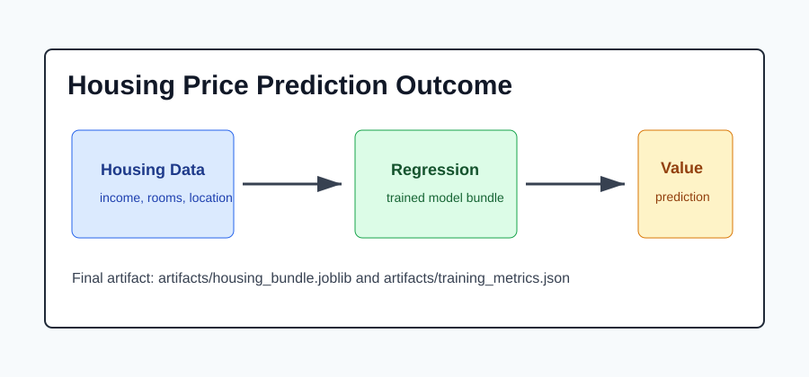

# Outcome: Housing Price Prediction



## Result Summary

After training, the project creates a reusable regression bundle and a metrics report. The prediction command accepts either a sample row or manually supplied housing features and returns an estimated median house value.

## Example Run

```bash
python src/train.py
python src/predict.py --sample-index 0
```

## What The Output Shows

| Output | Meaning |
|--------|---------|
| Model name | The selected regression model saved in the bundle. |
| Feature table | The exact input values used for the prediction. |
| Predicted value | The estimated median house value. |

## Files Produced

- `artifacts/housing_bundle.joblib`
- `artifacts/training_metrics.json`

## How To Present This Project

Explain that this is a tabular regression project. The important result is not only the predicted value, but the full workflow: train, evaluate, save, reload, and predict.
