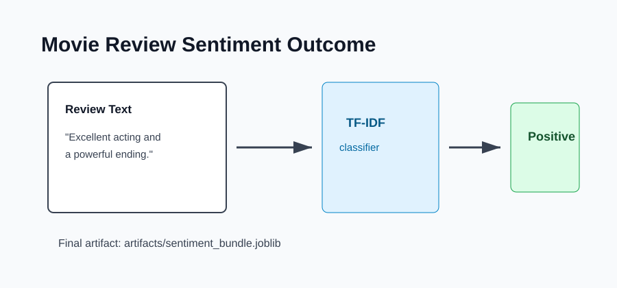

# Outcome: Movie Review Sentiment Analysis



## Result Summary

The project produces a reusable sentiment classifier. After training, users can submit a review sentence and receive a positive or negative prediction.

## Example Run

```bash
python src/train.py
python src/predict.py --text "The acting was excellent and the ending was powerful."
```

## What The Output Shows

| Output | Meaning |
|--------|---------|
| Model | The classifier selected during training. |
| Prediction | The final sentiment label. |
| Probabilities | Confidence scores for each class when supported. |

## Files Produced

- `artifacts/sentiment_bundle.joblib`
- `artifacts/sentiment_report.json`

## Presentation Note

This is a clear NLP classification example because it transforms unstructured text into numeric features and then uses those features to make a measurable prediction.
