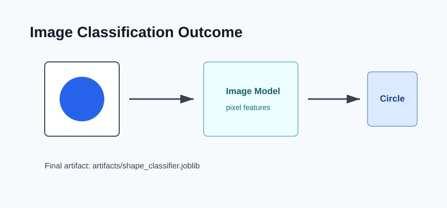

# Outcome: Image Classification CNN



## Result Summary

The project creates demo images and trains a classifier that predicts the shape shown in a PNG file.

## Example Run

```bash
python src/train.py
python src/generate_demo_images.py
python src/predict.py --image-path sample_data/demo_images/circle_0.png
```

## Files Produced

- `artifacts/shape_classifier.joblib`
- `artifacts/shape_classifier_report.json`
- `sample_data/demo_images/`

## What The Output Shows

The output shows the predicted label and probability scores for each possible shape class.
