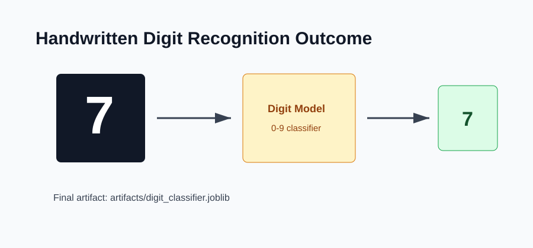

# Outcome: Handwritten Digit Recognition



## Result Summary

The project trains a model that recognizes handwritten digits and saves a reusable prediction bundle.

## Example Run

```bash
python src/train.py
python src/export_demo_images.py
python src/predict.py --sample-index 0
```

## Files Produced

- `artifacts/digit_classifier.joblib`
- `artifacts/digit_classifier_report.json`
- `sample_data/demo_digits/`

## What The Output Shows

The output shows the predicted digit and probability values for digit classes from `0` to `9`.
