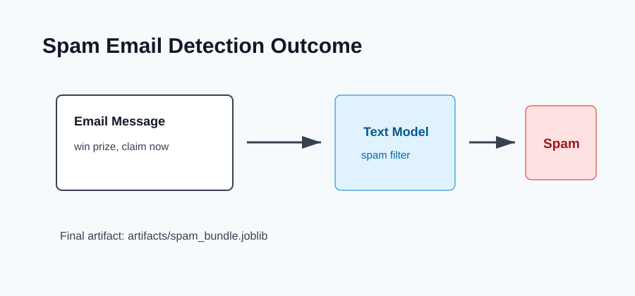

# Outcome: Spam Email Detection



## Result Summary

The project trains a spam detector that scores incoming email text and predicts whether it is spam or ham.

## Example Run

```bash
python src/train.py
python src/predict.py --text "Congratulations, you won a prize. Click now to claim."
```

## Files Produced

- `artifacts/spam_bundle.joblib`
- `artifacts/spam_report.json`

## What The Output Shows

The output shows the chosen model, the predicted label, and class probabilities if the model supports them.
