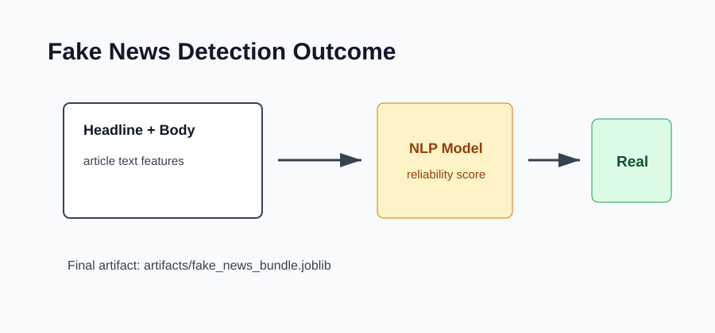

# Outcome: Fake News Detection



## Result Summary

The project trains a classifier that scores news headlines and article bodies, then predicts whether the item is fake or real.

## Example Run

```bash
python src/train.py
python src/predict.py --headline "Scientists confirm new climate milestone" --body "Researchers published verified findings after a multi-year study."
```

## Files Produced

- `artifacts/fake_news_bundle.joblib`
- `artifacts/fake_news_report.json`

## What The Output Shows

The output shows the model name, final label, and probability scores where available.
