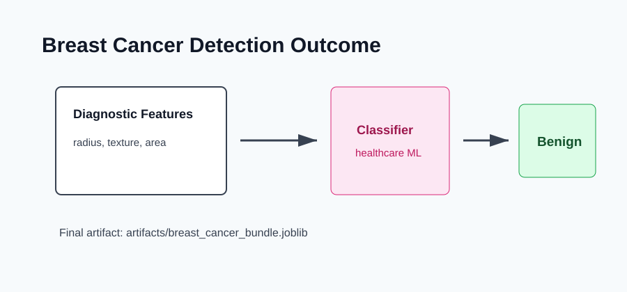

# Outcome: Breast Cancer Detection



## Result Summary

The project trains a healthcare classification model and predicts whether a selected sample is benign or malignant.

## Example Run

```bash
python src/train.py
python src/predict.py --sample-index 0
```

## Files Produced

- `artifacts/breast_cancer_bundle.joblib`
- `artifacts/breast_cancer_report.json`

## What The Output Shows

The output includes the model name, sample index, predicted class, and class probabilities.

## Responsible Use

This is a learning project only. Medical AI requires extensive validation and expert oversight before real-world use.
