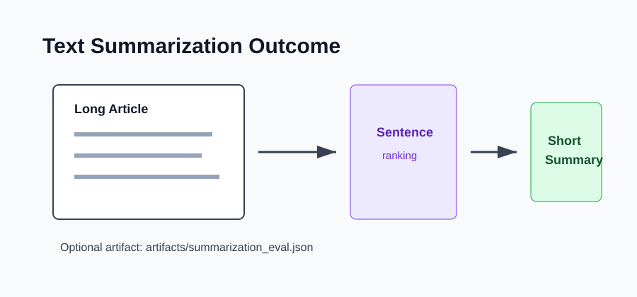

# Outcome: Text Summarization NLP



## Result Summary

The project reads article text and returns a compact extractive summary made from the most relevant sentences.

## Example Run

```bash
python src/summarize.py --row-index 0 --sentences 2
```

## Files Produced

- `artifacts/summarization_eval.json` when evaluation is requested.

## What The Output Shows

The output shows the article title, generated summary, optional reference summary, and overlap metrics.
