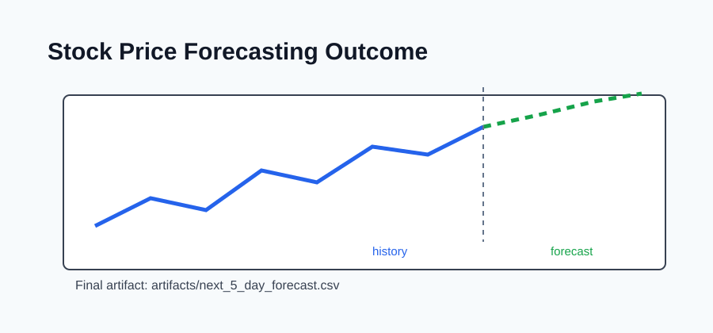

# Outcome: Stock Price Prediction



## Result Summary

The project trains a time-series forecaster and produces a short CSV forecast for upcoming closing prices.

## Example Run

```bash
python src/train.py
python src/forecast.py --steps 5
```

## Files Produced

- `artifacts/stock_forecaster.joblib`
- `artifacts/stock_forecaster_report.json`
- `artifacts/next_5_day_forecast.csv`

## What The Output Shows

The output lists future dates and their predicted closing prices.
