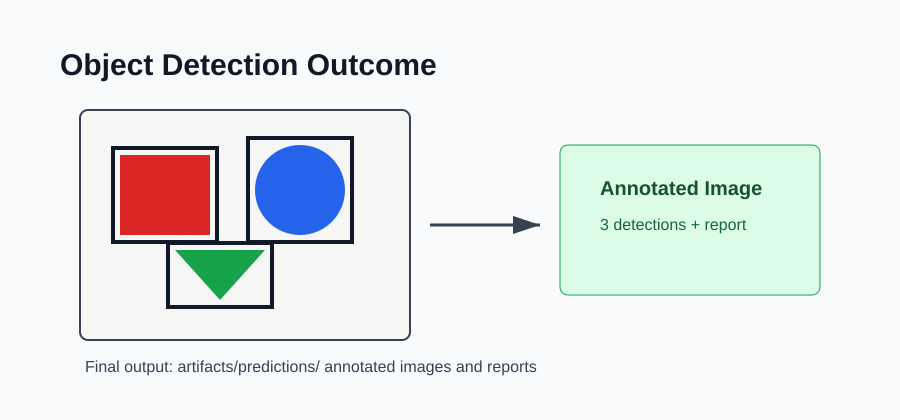

# Outcome: Object Detection YOLO Workflow



## Result Summary

The project creates demo scenes, detects objects, draws bounding boxes, and saves annotated prediction outputs.

## Example Run

```bash
python src/generate_demo_data.py
python src/detect.py
```

## Files Produced

- `sample_data/demo_scene_1.png`
- `sample_data/demo_scene_2.png`
- `artifacts/predictions/`

## What The Output Shows

The output shows which images were processed, where annotated images were saved, where reports were saved, and how many detections were found.

## Visual Result

The saved annotated images in `artifacts/predictions/` are the main deliverable for this project.
